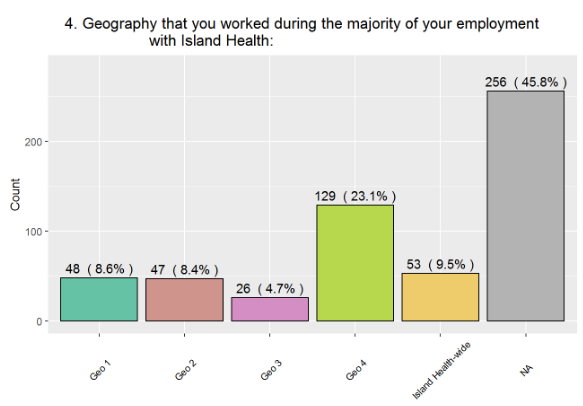
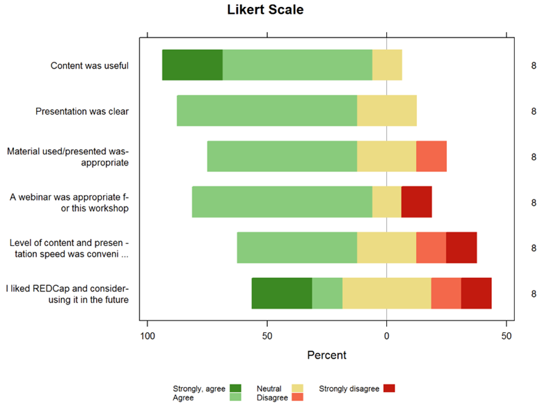
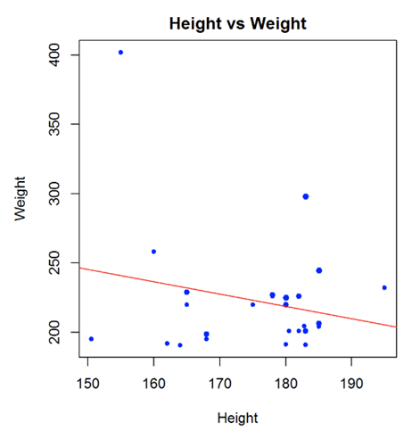
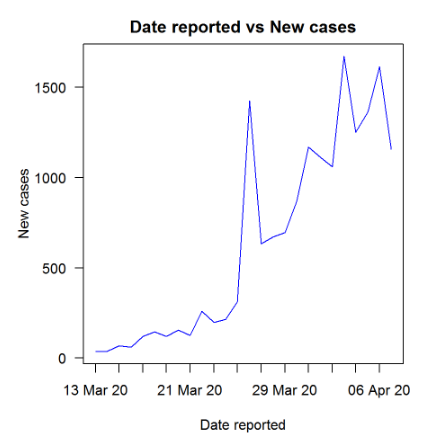
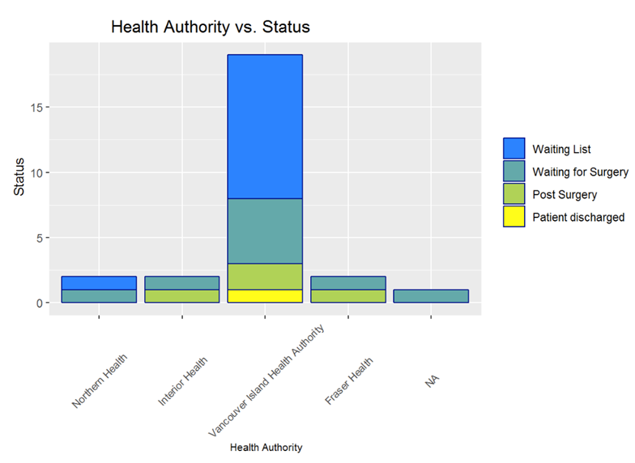
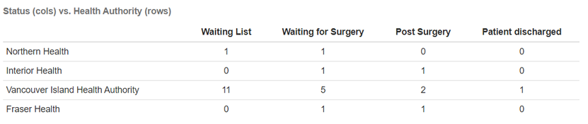
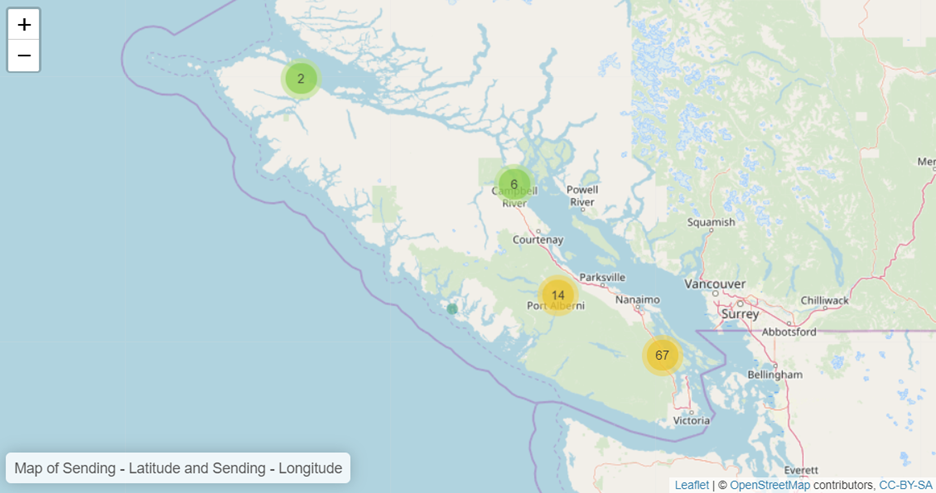
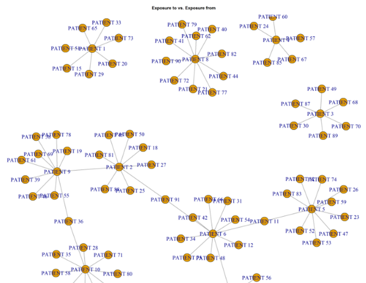

# REDCap module: Advanced Graphs
<b>This module is deprecated. The module authors will not be actively developing features or fixing bugs. They have created a new graphing External Module called <i>Advanced Graphs for Reports.</i> </b>
This REDCap module displays additional advanced graphs from a report in an easy and secure way for REDCap projects, much in the same way as the existing Graphs and Charts tool. 

 The type of graphs generated include bar charts, Likert scale, scatter plots, stacked bars, cross tabulations, geographical maps and networks. Graphs and tables use labels from the data dictionary for field names and options/categories.

## Prerequisites
- REDCap >= 8.10.12 (It hasn't been tested for previous versions but it may still work for some recent ones).
- R Software for stats >= v 3.5.3 and libraries stringi, RColorBrewer, expss, formattable, ggplot2, htmltools, htmlwidgets, leaflet, likert, plyr, psych, RCurl, HH, stringr, igraph and tidyr 
- Export API for each project to use the module

## Easy Installation
- Obtain this module from the Consortium [REDCap Repo](https://redcap.vanderbilt.edu/consortium/modules/index.php) from the control center.

## Manual Installation
- Clone this repo into `<redcap-root>/modules/advanced_graphs_v2.0.0`.
- Go to **Control Center > External Modules** and enable Advanced Graphs.
- To activate this module for a particular project, go to the project home page, click on the **External Modules** link, and then enable Advanced Graphs for that project.

## Configuration
Once you enable the Advanced Graphs module, you need to complete a simple configuration process in the Control Center. The elements you need to define are:
 
 - Enable how projects will use Advanced Graphs
 - Include **paths** for RScript, Pandoc and R libraries
 - Include **tokens** created for projects to use Advanced Graphs (to have control on who is using it)

## Usage
To display any of the graphs and tables you need to have a regular REDCap report **open** and click the bookmark **Advanced Graphs** in the External Modules list.

The graphs displayed are selected automatically from the **type of fields** included in the report. 

Fields considered are **categorical** (radio buttons, dropdown lists or checkboxes) or **numeric**, **dates**, **calculated fields** and **plain text fields**; 
the External Module also considers **key words** in the field name or existing options (for Likert scale graphs or geographic maps, for example). Key words considered are in English and Spanish.

In several cases a **couple of graphs** are displayed showing each field involved in a bi-dimensional graph in each of the **horizontal/vertical axes**.

It is recommended to use all features in reports to get adequate graphs. In particular, **filters** are useful to eliminate undesired cases (when appropriate).

Since graphs are generated automatically, their number depends on the number of fields considered in the report. it is recommended to **limit the number of fields** in a report in order to prevent an overflow of graphs. 

In certain particular situations when a graph cannot be displayed or cannot be displayed properly (when no graph can be displayed; when there are too many categories to display the graph properly; for example), appropriate messages are shown.

## Live filters

Advanced Graphs takes into consideration live filters selected within the report, except when a filter is selected but the record id field is not included in the report.

## Limitations

Checkboxes in graphs do not work if options are combined into a single column.

yes/no, true/false, signature, file upload, slider, descriptive and dynamic SQL fields are not considered for graphing.

Avoid including a great proportion of empty cells in a report or very large reports, as they may cause the graphs to break (removing causes are coming in future versions).

**Events and Repeated events/instruments** are not considered explicitly in this version. This means that Advanced Graphs works for longitudinal studies but do not consider events or repeated forms/events as a variable in the graphs.

Default reports **A** and **B** from "Data Exports, Reports, and Stats" are not considered in Advanced Graphs.

## Graphs included
The possible types of graphs and tables this module can generate are:

**BAR GRAPHS**

Bar graphs are displayed horizontally for radio buttons, drop-down list and checkboxes, using different colors and showing value/percentage for each bar.  
The maximum number of this kind of bar graphs that can be displayed in a given report is 20.  
When there are many bars, percentage is ommitted.   
When there  is an option "other" in a checkbox and there is an associated description field included in the report, 
that field responses are shown in a table below the graph if the field is labeled as "Please describe other", 
"Please describe", "Describe other", "Other",
"Por favor describa otro", "Por favor describa", "Describa otro" or "Otro".  

**LIKERT SCALE**

These are bar graphs specifically designed for preference (ordinal with positive/negative) options, especially useful in surveys.  
It detects if in a radio or dropdown field there is an option with any of the phrases 
"not useful", "not at all useful", "difficult", "none of my needs", "strongly disagree", "somewhat disagree", 
"completely disagree", "quite dissatisfied", "very dissatisfied", "Extremely dissatisfied", "poor", "never", 
"worse", "severely ill", 
"inutil", "in\u00fatil", "completamente inutil", "completamente in\u00fatil", "dificil", "dif\u00edcil", 
"ninguna de mis necesidades", "totalmente en desacuerdo", "parcialemnte en desacuerdo", 
"completamente en desacuerdo", "muy insatisfecho(a)", "totalmente insatisfecho(a)", "nunca", "peor", 
"gravemente enfermo"  
It groups all fields included in the report with the same type of response and 
order them from most positive to less positive responses  

**SCATTER PLOT**

Representation of a bi-dimensional dots graph relating two text fields, either numeric or with date format.  
For each possible graph, it plots two of them using the same fields, with the axes interchanged.  
It skips fields with "longitude" or "latitude" ("longitud" or "latitud", in Spanish) in their name, as they are better represented using a geographical map, considered below.  

**STACKED BARS AND TABULATIONS**

These are bars relating two fields.  
Each bar represents the frequency of a category for a radio or dropdown field, 
broken by parts representing the frequency of another categorical field.  
A couple of graphs are displayed showing each field involved in the graph in the horizontal and in the vertical axes.
It also presents a cross tabulation of the frequencies.  
The maximum number of this kind of graphs that can be displayed in a given report is 20 (pairs).  

**GEOGRAPHIC MAPS**

Maps coordinates included in a REDCap report in a map showing dots with the number of occurrences.  
It identifies a couple of fields with the same label, except for the words "longitude" and "latitude" 
(or "longitud" and "latitud", in Spanish).  
The resulting map can be zoomed in or out.  
The maximum number of this kind of graphs that can be displayed in a given report is 20.  

 

**NETWORKS**

Graphical representation of text fields connected by content; 
it can represent a network of connecting exposure.  
It takes any pair of text fields included in the report; 
some combinations may just represent responses for each record connected between them.  

## Testing instrument

This project includes an [Example Instrument](../../modules/advanced_graphs_v1.0.0/docs/AdvancedGraphsDemoProject_2020-01-15.zip) that includes fields, data and reports that can be used to produce each of the type of graphs included in Advanced Graphs. 
It has to be added in the configuration. This is suitable for testing or demonstration purposes.

## Acknowledgements
 * The original R script to deploy graphs was devised by Victor Espinosa at Vancouver Island Health Authority.  
 * The plugin to trigger the graphs was written by Alvaro Ciganda and converted to an external module.
 * Alvaro Ciganda greatly contributed to improve efficiency in the R code.
 * Victor Espinosa collaborated in documenting the external module.
